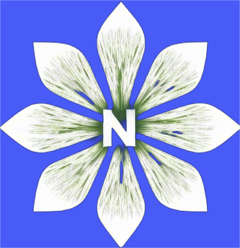

# MLRec

<div align="center">
  
  <h1>茉莉-Rec (MLRec)</h1>
  <h3>多模态学习推荐算法框架 | Powered by OrangeAI </h3>

  []()
  []()
  []()
  []()
</div>

---

## 🌸 项目介绍

**茉莉-Rec (MLRec)** 一个简单优雅的多模态深度学习推荐算法框架，旨在为推荐系统开发者提供从数据处理到模型训练、评估的一站式解决方案。项目以茉莉花的简单优雅融合为灵感，致力于实现多模态数据的协同推荐，支持文本、图像、视频和图结构数据的深度融合。

---

## 🎯 核心特性

- **多模态数据支持**：内置经典推荐数据集（如 MovieLens、Amazon Reviews、Pinterest 视觉图谱），并提供统一的数据预处理模块。
- **丰富的模型库**：集成图神经网络（GNN）、扩散模型、知识蒸馏、大模型适配器等前沿架构。
- **全面的评估体系**：支持 Recall@K、NDCG@K、Precision@K 等经典指标，并提供多模态相似度评估工具。
- **大模型友好**：原生支持 LLM-as-Judge 评估范式，适配大模型推荐场景。

---

## 🚀 快速开始

### 安装

```bash
pip install mlrec


from mlrec import MultiModalLoader
from mlrec.models import DiffusionRec

# 加载多模态数据
dataset = MultiModalLoader(name="amazon-fashion").load()

# 初始化扩散推荐模型
model = DiffusionRec(
    visual_dim=512, 
    textual_dim=768,
    hidden_dim=256
)

# 训练与评估
trainer = MultimodalTrainer(model)
results = trainer.evaluate(metrics=["Recall@10", "NDCG@20"])
print(results)


🧩 架构设计
数据层
多模态数据集：支持 MovieLens、Amazon Reviews、Pinterest 视觉图谱等经典数据集。

数据预处理：提供多模态对齐、噪声过滤、时序切片等预处理工具。

模型层
图神经网络：LightGCN、GAT 等。

扩散模型：DiffRec 等生成式推荐模型。

知识蒸馏：支持跨域推荐（CDR）等场景。

大模型适配器：LLM4Rec 等大模型推荐工具。

评估层
经典指标：Recall@K、NDCG@K、Precision@K。

多模态评估：支持多模态特征相似度计算与可视化

📊 模型库
from mlrec.models import (
    LightGCN,  # 图神经推荐
    DiffRec,   # 扩散生成式推荐
    LLM4Rec,   # 大模型适配器
    MultimodalFusion  # 多模态融合层
)

📈 评估指标
Recall@K：衡量推荐结果的相关性。

NDCG@K：评估推荐列表的排序质量。

Precision@K：计算推荐结果的准确率。

多模态相似度：支持文本-图像、图像-视频等多模态特征对齐评估。


🌼 视觉设计
Logo：以茉莉花为灵感，抽象化为数据流组成的花瓣，中心用 </> 符号构成花蕊。

配色：主色调为茉莉白（#F4F5F7），搭配数据流的浅绿色（#8DC9B4）。

图标：用花瓣形状表示不同模态（文本/图像/视频/图谱）。

🤝 贡献指南
我们欢迎任何形式的贡献！以下是参与项目的几种方式：

提交新数据集：适配更多多模态推荐数据集。

开发新模型：实现前沿推荐算法。

扩展评估指标：添加新的评估指标或优化现有工具。

文档改进：完善文档或翻译。

请通过 GitHub Issue 提交您的想法或 Pull Request。


📜 许可证
本项目采用 MIT 许可证。

🌸 茉莉花开，推荐未来
让每一次推荐都散发多模态融合的芬芳！